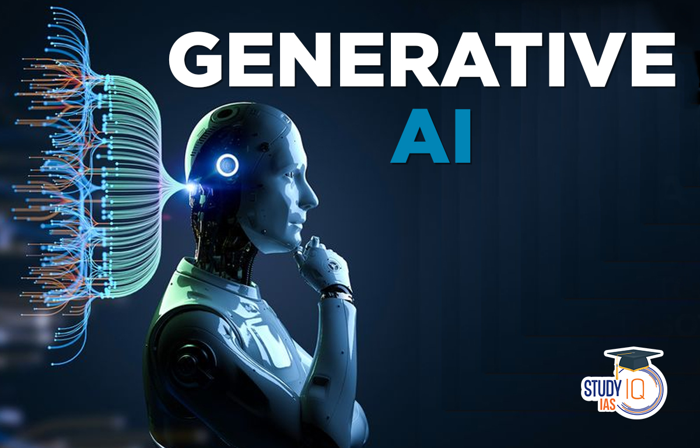

# iHealth: Changing the world, one step at a time.

## Welcome to iHealth, where innovation meets healthcare. We're dedicated to revolutionizing the medical landscape with cutting-edge AI solutions. Our mission is to provide accessible, accurate, and timely health insights to empower individuals in managing their well-being.

 

### Table of Content

- [Structure](#structure)
- [Purpose](#purpose)
- [How AI and Machine learning are Solving the Problem](#AL and ML)
- [License](#license)

 

------

##  structure

 - Frontend
  - Here, you will find the frontend code for the iHealth application, implemented using Flutter, and Dart. This directory also includes the Android, ios files for the user interface since flutter is used for cross-platform.
 - Backend
  - This directory contains the backend code of the iHealth application, including the API endpoints, database models, and business logic implemented in nodejs, a javascript runtime 

 

## Purpose

The repository serves as a centralized hub on GitHub for the iHealth project, housing both frontend and backend codebases, documentation, and project management tools. It facilitates collaborative development, version control, and efficient deployment processes for our AI-driven healthcare solution.

 

## How AI Machine learning are Solving the Problem

AI and Machine Learning plays a pivotal role in addressing iHealth's primary challenge: rapid and accurate diagnosis and patient treatment. 

 

### All of the source codes are available here.

- iHealth Frontend APP SOURCE CODE [@nnam-droid12](https://github.com/nnam-droid12/iHealth)
- iHealth Backend App SOURCE CODE [@nnam-droid12](https://github.com/nnam-droid12/iHealth-backend)